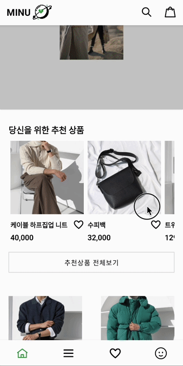
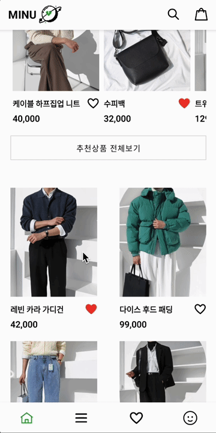
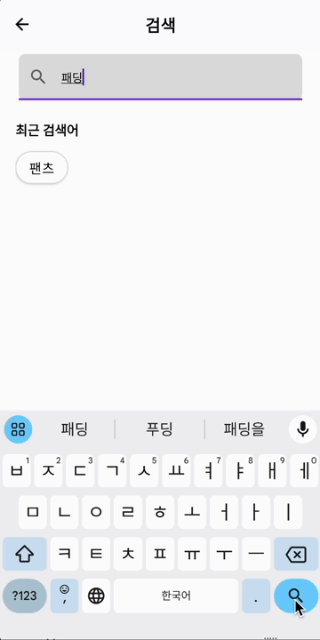
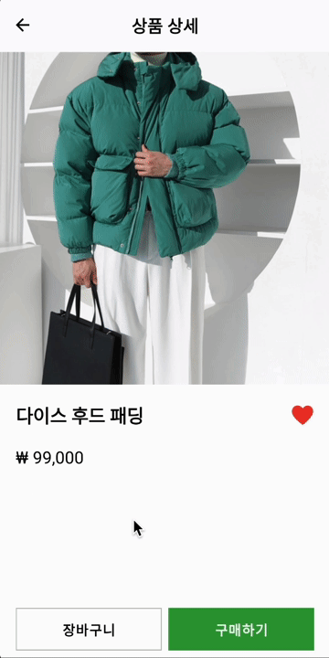
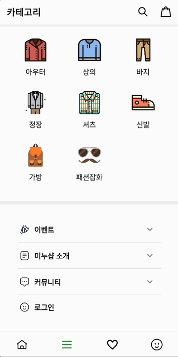
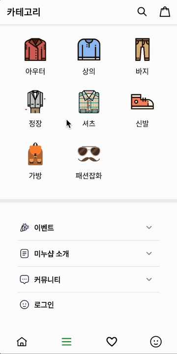
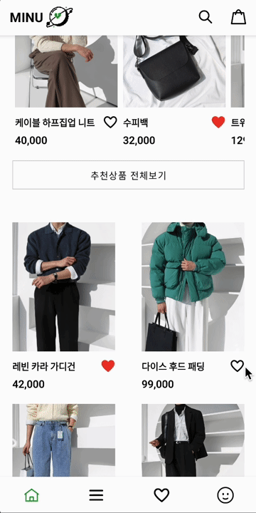
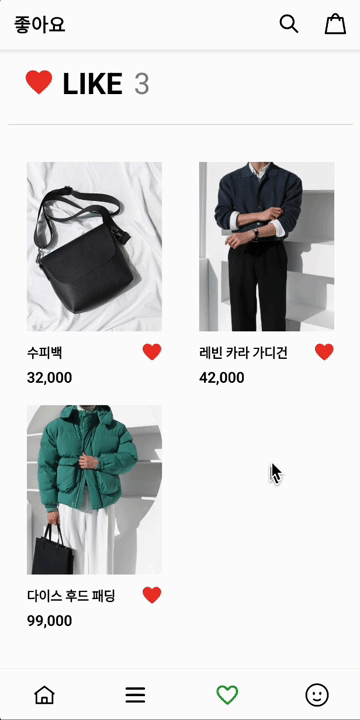
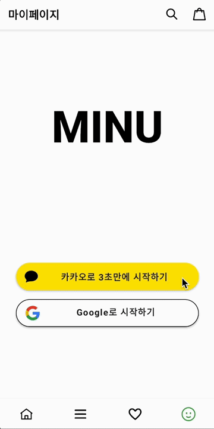
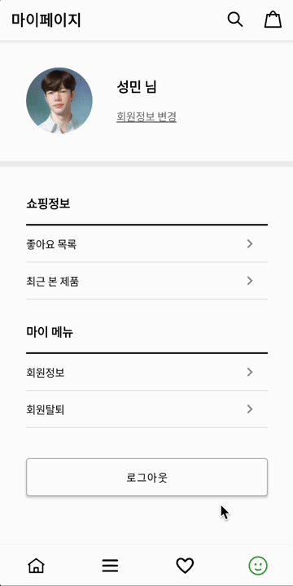

# 👕 미누샵 (MINU)

Android 개인 프로젝트

## 프로젝트 소개

쇼핑몰에서 사용되는 다양한 기능과 UI를 구현하고 싶어서 만든 앱

### 🛠️ 사용 기술 & 아키텍처

  
  

  
  

  
  
  
  
  
  
  
  

### 🖥️ 개발 환경

- Programming Language : `Kotlin`
- IDE : `Android Studio`
- Minimum SDK Version : `28`
- Compile SDK Version : `33`
- Target SDK Version : `33`

 

## 개발 기간

- 전체 개발 기간 : 2024-01-24 ~ 2024-02-04

 

## 페이지 기능

- 하단 BottomNavigation 탭별로 분리 (홈, 카테고리, 좋아요, 마이페이지)

### 1) 홈

|                          홈 페이지                           |                          자동 배너                           |                        상품 넘겨 보기                        |
| :----------------------------------------------------------: | :----------------------------------------------------------: | :----------------------------------------------------------: |
|  |  |  |
|                     **상품 상세 페이지**                     |                       **검색 페이지**                        |                     **장바구니 페이지**                      |
|  |  |  |

## 2) 카테고리
|                       카테고리 페이지                        |                        카테고리 선택                         |
| :----------------------------------------------------------: | :----------------------------------------------------------: |
|  |  |

## 3) 좋아요

|                      상품 좋아요 누르기                      |                      좋아요 목록 페이지                      |
| :----------------------------------------------------------: | :----------------------------------------------------------: |
|  |  |

## 4) 마이페이지

|                     SNS 로그인 (카카오)                      |                          마이페이지                          |                           로그아웃                           |
| :----------------------------------------------------------: | :----------------------------------------------------------: | :----------------------------------------------------------: |
|  |  |  |
